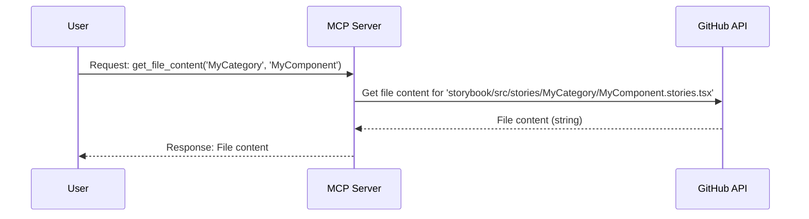

# Architecture Plan: Maas-React-Components QA MCP Server

This document outlines the architectural plan for a new MCP server that acts as a GitHub API wrapper for the `maas-react-components` repository. The server will allow users to ask questions about components by fetching information from the `storybook/src/stories` directory.

## 1. Project Structure

The project is located in `tools/mrc-qa-mcp` and has the following structure:

```
mrc-qa-mcp/
├── build/                     # Compiled JavaScript output
├── src/                      # TypeScript source code
│   ├── tools/                # MCP tool implementations
│   │   ├── getCategories.ts
│   │   ├── getComponentStoriesNames.ts
│   │   ├── getFileContent.ts
│   │   └── handleQuestion.ts
│   └── types/                # TypeScript type definitions
│       └── index.ts
├── .env.example              # Example environment variables
├── package.json              # Project dependencies and scripts
└── tsconfig.json             # TypeScript configuration
```

## 2. Key Components

### MCP Server Entrypoint (`src/index.ts`)

- **Responsibility:** Initializes and runs the MCP server.
- **Details:**
  - It uses the `@modelcontextprotocol/sdk` package to create a new MCP server instance.
  - It registers the tools defined in the `src/tools/` directory.
  - It handles server startup and shutdown gracefully.
  - It loads configuration from environment variables.

### Tool Implementations (`src/tools/`)

The server exposes the following tools:

- **`get_categories()`:**

  - Uses the GitHub API to get the directory structure under `storybook/src/stories`.
  - The directory names are treated as component categories.
  - Returns a list of available component categories.

- **`get_component_stories_names(category: string)`:**

  - Takes a category name as input.
  - Uses the GitHub API to get the file names under `storybook/src/stories/{category}`.
  - The file names are treated as component names.
  - Returns a list of available component names for the given category.

- **`get_file_content(category: string, component: string)`:**

  - Takes a category and a component name as input.
  - Uses the GitHub API to find the corresponding story file.
  - Returns the content of the story file.

- **`handle_question(question: string)`:**
  - This is an advanced tool that uses an LLM to answer natural language questions.
  - It leverages the other tools to gather context before answering the question.

## 3. Data Flow

The data flow for a typical request (e.g., `get_file_content`) is as follows:



## 4. Configuration

The server is configured using environment variables. A `.env` file is used for local development.

- `GITHUB_TOKEN`: A personal access token with repository read permissions.
- `REPO_OWNER`: The owner of the GitHub repository (e.g., `SolaceDev`).
- `REPO_NAME`: The name of the repository (e.g., `maas-react-components`).
- `REPO_BRANCH`: The branch to fetch data from (e.g., `main`).
