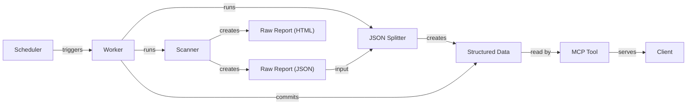

# MRC-Usage-Report Ecosystem

## Overall Goal

The project's primary goal is to automatically track, report, and query the usage of MaaS React Components across multiple applications and micro-frontends (MFEs). This is achieved through a multi-stage pipeline that scans the codebase, processes the data, and serves it through a queryable API.

## Architecture Diagram

The following diagram illustrates the flow of data from the initial scan to the final API query.



## Components

The ecosystem consists of several key components that work together:

- **MRC Usage Report Tool (The "Scanner"):** This tool is responsible for scanning the source code of various applications and MFEs. It identifies instances where MaaS React Components are used and generates a single, comprehensive raw JSON report named `mrc-usage-report-all.json`. It also generates an `mrc-usage-report-all.html` file as a human-readable backup report.

- **JSON Splitter (The "Transformer"):** This component takes the large, raw JSON report as input. It processes and transforms this data into a structured, hierarchical format, which is then stored in the `mrc-usage-report-data` directory.

- **`mrc-usage-report-data` Directory (The "Database"):** This directory serves as the version-controlled data source for the system. It contains the structured data produced by the JSON Splitter, organized in a way that is optimized for efficient querying.

- **MRC MCP Tool (The "API"):** This is a Model Context Protocol (MCP) server that acts as a queryable API. It reads data directly from the `mrc-usage-report-data` directory and exposes it to developers or other clients, allowing them to perform detailed queries on component usage.

- **GitHub Actions Workflows:** The entire pipeline is automated using GitHub Actions. A scheduled workflow triggers the process everyday in the morning, which runs the Scanner, then the JSON Splitter, and finally commits the resulting structured data to a dedicated Git branch. This ensures the usage data is always up-to-date. If there is some error and a mfe / applications scans for 0 components used, instead of updated, the data won't update, somewhat preventing the mcp server tool from breaking.

## How to add a new Application or MFE

This guide outlines the steps required to add a new application or a new Micro-Frontend (MFE) to an existing application within the MRC usage tracking system.

### Adding a New Application

Follow these steps to integrate a new application (e.g., `my-new-app`):

1.  **Update the Worker Workflow:**

    - Navigate to `.github/workflows/mrc-usage-report-worker.yml`.
    - Add a new `checkout` step to clone your new application's repository. This ensures the application's source code is available for scanning.
    - Assign a unique `path` for the checkout, for example: `path: my-new-app`.

    ```yaml
    # In .github/workflows/mrc-usage-report-worker.yml

    # ... existing checkout steps

    - name: Checkout my-new-app
      uses: actions/checkout@v4
      with:
        repository: SolaceDev/my-new-app
        ref: main # Or the relevant branch
        path: my-new-app
        token: ${{ secrets.PACKAGES_ADMIN_TOKEN }}
    ```

2.  **Update the Report Generator (Scanner):**

    - Open `tools/mrc-usage-report/src/index.ts`.
    - In the `discoverMfes` function, add the logic to discover MFEs within your new application. This typically involves reading the directory structure of your new application's repository.
    - You will also need to add a new command-line option to pass the path to your new application's repository to the script.

    ```typescript
    // In tools/mrc-usage-report/src/index.ts

    // Add a new option for the application path
    program
    	// ... existing options
    	.option("--my-new-app-path <path>", "Path to the my-new-app repository", "../../my-new-app");

    // In the discoverMfes function, add logic to scan the new application
    async function discoverMfes(
    	// ... existing parameters
    	myNewAppPath: string
    	// ...
    ) {
    	// ... existing logic

    	// Discover all MFEs in my-new-app
    	const myNewAppMfePath = path.join(myNewAppPath, "micro-frontends"); // Adjust if necessary
    	const myNewAppMfes = fs.readdirSync(myNewAppMfePath);
    	// ... filtering logic
    	for (const mfe of myNewAppMfes) {
    		mfeInfos.push({
    			name: mfe,
    			path: path.join(myNewAppMfePath, mfe),
    			repository: "my-new-app"
    		});
    	}
    }
    ```

3.  **Update the JSON Splitter:**

    - Open `tools/mrc-usage-report-json-splitter/src/index.ts`.
    - Update the `appMfeMap` object to include your new application and its associated MFEs.

    ```typescript
    // In tools/mrc-usage-report-json-splitter/src/index.ts

    const appMfeMap: { [key: string]: string[] } = {
    	// ... existing entries
    	"my-new-app": ["mfe1", "mfe2"] // Add your new app and its MFEs
    };
    ```

4.  **Update the MCP Server:**
    - The MCP server in `tools/mrc-usage-mcp/src/index.ts` should automatically pick up the new application and its MFEs after the data is generated and committed. No manual changes are typically required here.

### Adding a New MFE to an Existing Application

To add a new MFE to an existing application (e.g., adding `new-mfe` to `maas-ui`), the process is simpler as the system is designed to automatically discover new MFEs within existing application repositories.

1.  **Verify MFE Discovery:**

    - Ensure that the `discoverMfes` function in `tools/mrc-usage-report/src/index.ts` is correctly configured to scan the `micro-frontends` directory of the application's repository.
    - As long as your new MFE is located in the expected directory, the report generator will automatically include it in the next run.

2.  **Update the JSON Splitter:**

    - Open `tools/mrc-usage-report-json-splitter/src/index.ts`.
    - Add the new MFE to the `appMfeMap` for the corresponding application.

    ```typescript
    // In tools/mrc-usage-report-json-splitter/src/index.ts

    const appMfeMap: { [key: string]: string[] } = {
    	"maas-ui": ["ep", "intg", "mc", "saas", "new-mfe"] // Add the new MFE
    	// ... other entries
    };
    ```

Once these changes are in place, the next scheduled run of the GitHub Actions workflow will generate the updated usage report, and the new application and/or MFE data will be available through the MCP server.
