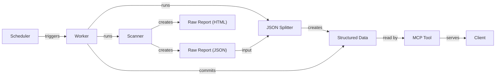

# MRC-Usage-Report Ecosystem

## Overall Goal

The project's primary goal is to automatically track, report, and query the usage of MaaS React Components across multiple applications and micro-frontends (MFEs). This is achieved through a multi-stage pipeline that scans the codebase, processes the data, and serves it through a queryable API.

## Architecture Diagram

The following diagram illustrates the flow of data from the initial scan to the final API query.

## Components

The ecosystem consists of several key components that work together:

- **MRC Usage Report Tool (The "Scanner"):** This tool is responsible for scanning the source code of various applications and MFEs. It identifies instances where MaaS React Components are used and generates a single, comprehensive raw JSON report named `mrc-usage-report-all.json`. It also generates an `mrc-usage-report-all.html` file as a human-readable backup report.

- **JSON Splitter (The "Transformer"):** This component takes the large, raw JSON report as input. It processes and transforms this data into a structured, hierarchical format, which is then stored in the `mrc-usage-report-data` directory.

- **`mrc-usage-report-data` Directory (The "Database"):** This directory serves as the version-controlled data source for the system. It contains the structured data produced by the JSON Splitter, organized in a way that is optimized for efficient querying.

- **MRC MCP Tool (The "API"):** This is a Model Context Protocol (MCP) server that acts as a queryable API. It reads data directly from the `mrc-usage-report-data` directory and exposes it to developers or other clients, allowing them to perform detailed queries on component usage.

- **GitHub Actions Workflows:** The entire pipeline is automated using GitHub Actions. A scheduled workflow triggers the process everyday in the morning, which runs the Scanner, then the JSON Splitter, and finally commits the resulting structured data to a dedicated Git branch. This ensures the usage data is always up-to-date. If there is some error and a mfe / applications scans for 0 components used, instead of updated, the data won't update, somewhat preventing the mcp server tool from breaking.
