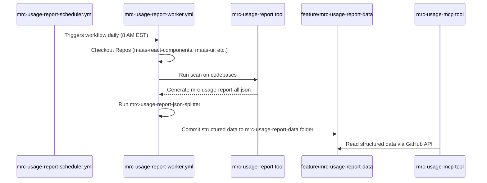

# MRC Usage Report Workflow Architecture

This document outlines the architecture and workflow of the MRC (MaaS React Components) Usage Report generation system. The system is designed to automatically scan various application codebases, generate a comprehensive report on component usage, and make this data available for querying and analysis.

## Architecture Diagram

## Components

### `mrc-usage-report-scheduler.yml`

- **Purpose**: Acts as a simple and reliable timer that triggers the `mrc-usage-report-worker.yml` workflow.
- **Responsibilities**:
  1.  **Trigger**: Uses a `schedule` event to run automatically at a specified time (daily at 8 AM EST / 12 PM UTC).
  2.  **Invoke Worker**: Dispatches a `workflow_dispatch` event to trigger the `mrc-usage-report-worker.yml` workflow, passing any necessary inputs.
- **Branch**: Resides on the `main` branch to comply with GitHub's requirements for scheduled workflows.

### `mrc-usage-report-worker.yml`

- **Purpose**: Contains the primary logic for generating the MRC usage report.
- **Responsibilities**:
  1.  **Checkout Source**: Checks out the `maas-react-components` repository to gain access to the reporting tools.
  2.  **Checkout Targets**: Checks out the target application repositories (`maas-ui`, `maas-ops-ui`, `broker-manager`) into a local directory.
  3.  **Run Report Tool**: Executes the `mrc-usage-report` tool, pointing it at the checked-out application codebases.
  4.  **Process Report**: Runs the `mrc-usage-report-json-splitter` script to transform the single large JSON report into a structured, directory-based format.
  5.  **Commit Data**: Configures Git with a bot identity, then adds, commits, and pushes the structured data to the `mrc-usage-report-data` folder in the `feature/mrc-usage-report-data` branch.
  6.  **Upload Artifacts**: Uploads the generated raw reports (`mrc-usage-report-all.json`, etc.) as build artifacts for debugging and historical records.
- **Trigger**: Can be triggered by `mrc-usage-report-scheduler.yml` via `workflow_dispatch` or manually.

### `mrc-usage-report` tool

- **Purpose**: A command-line utility that scans the source code of specified applications to identify how and where MaaS React Components are used.
- **Responsibilities**:
  1.  **Discover MFEs**: Scans the directory structure of each application to identify Micro-Frontends (MFEs) by looking for `package.json` files.
  2.  **Find Source Files**: Within each MFE, it finds all relevant source files (`.ts`, `.tsx`, `.js`, `.jsx`).
  3.  **Parse Imports**: Parses each file to create an Abstract Syntax Tree (AST) and identifies `import` statements from `@solace-community/maas-react-components`.
  4.  **Identify Usage**: Traverses the AST to find where the imported components are used as JSX elements.
  5.  **Extract Props**: For each component instance found, it extracts the names and values of all props being passed to it.
  6.  **Aggregate Data**: Compiles the collected data (application, MFE, file path, component name, props) into a single, comprehensive data structure.
  7.  **Generate Reports**: Outputs the aggregated data into multiple formats, including a detailed `mrc-usage-report-all.json` and a human-readable HTML report.

### `mrc-usage-mcp` tool

- **Purpose**: A Model Context Protocol (MCP) server that provides a queryable API for the generated component usage data.
- **Responsibilities**:
  1.  **Initialize**: On startup, the server initializes a GitHub API client using a provided token.
  2.  **Listen for Queries**: It exposes a set of tools (e.g., `get_component_usage_all`, `get_component_usage_by_mfe`) that can be called by an MCP client.
  3.  **Fetch Data**: When a query is received, it makes a request to the GitHub API to fetch the directory listing and file contents from the `mrc-usage-report-data` folder on the `feature/mrc-usage-report-data` branch.
  4.  **Process and Serve**: It parses the JSON data from the fetched files, filters it according to the query parameters, and returns the result to the client.

## Workflow Description

The following steps describe the end-to-end process of generating and consuming the MRC usage report:

1.  **Schedule Trigger**: The `mrc-usage-report-scheduler.yml` workflow, running on a daily schedule, initiates the process.
2.  **Worker Invocation**: The scheduler triggers the `mrc-usage-report-worker.yml` workflow using a `workflow_dispatch` event.
3.  **Code Checkout**: The worker checks out the latest versions of the required application repositories.
4.  **Scanning and Reporting**: The worker executes the `mrc-usage-report` command-line tool. The tool scans the checked-out code and generates a single, large JSON file named `mrc-usage-report-all.json`.
5.  **Data Processing**: The worker then runs the `mrc-usage-report-json-splitter` tool. This script processes `mrc-usage-report-all.json` and breaks it down into a more structured, queryable format (e.g., one file per component per MFE).
6.  **Data Persistence**: The worker commits the structured data files to the `mrc-usage-report-data` folder within the `feature/mrc-usage-report-data` branch.
7.  **API Access**: The `mrc-usage-mcp` server is configured to read data from the `feature/mrc-usage-report-data` branch. It fetches the structured JSON files via the GitHub API to serve queries about component usage.

## Design Decisions

### Why are the scheduler and worker in separate workflow files?

The scheduler is separated from the worker to create a clean, single-purpose timer. GitHub requires scheduled workflows to be on the default branch (`main`). The worker logic, however, operates on a feature branch (`feature/mrc-usage-report-data`) to commit its results. This separation allows the scheduler to remain on `main` while the worker can be developed and tested on its own branch without affecting the production schedule.

### Why is the report data stored in a separate branch?

The generated report data is stored in the `feature/mrc-usage-report-data` branch to isolate it from the main codebase. This prevents the main development branches from being cluttered with frequently updated, auto-generated data. It also provides a stable, independent location for the `mrc-usage-mcp` server to fetch data from.

### Why does the MCP server fetch data from GitHub directly?

The `mrc-usage-mcp` server fetches data directly from the GitHub repository via its API. This decouples the data source from the server's deployment. The server doesn't need access to a local file system or a separate database, simplifying its architecture. It can be run anywhere and still access the most up-to-date usage data as long as it has a GitHub token.
